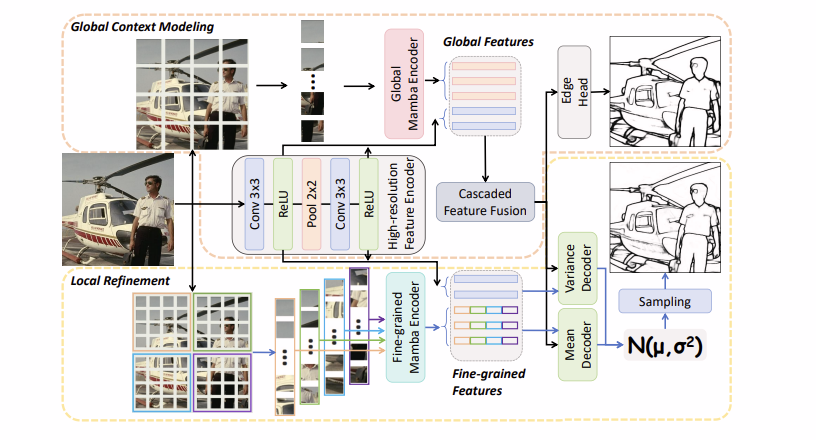
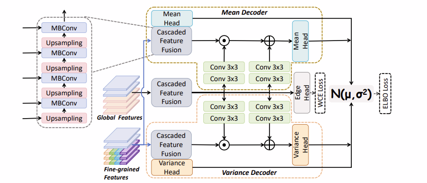

EDMB: Edge Detector with Mamba
📌 Overview

EDMB (Edge Detector with Mamba) is a deep learning-based edge detection framework that combines the efficiency of Vision Mamba (state-space models) with a global-local architecture to produce high-quality, multi-granularity edges.

Unlike Transformer-based edge detectors, EDMB significantly reduces computational cost while still capturing:

Long-range dependencies (global context)
Fine-grained local details (thin edges)

Additionally, EDMB introduces a probabilistic edge generation approach using learnable Gaussian distributions, enabling it to generate multi-granularity edges even from single-label datasets.
🏗️ EDMB Architecture

🔹 Pipeline Summary
Input image → passed into:
Global Mamba Encoder
Fine-Grained Mamba Encoder
High-Resolution CNN Encoder
Extracted features:
Global features: Fg
Fine-grained features: Ff
High-resolution features: Fh
Features are fused and passed to the decoder:
Produces Gaussian distributions (μ, σ²)
Final edges are generated by:
p = μ + γσ²

Where:

μ = mean (base edge map)
σ² = variance (controls edge thickness/detail)
γ = granularity parameter

🎯 Multi-Granularity Edge Generation

EDMB allows flexible edge outputs:

γ value	Edge Type
Low (negative)	Thin, fine edges
0	Standard edges
High (positive)	Thicker, coarse edges

This is useful for:

Segmentation → coarse edges
Image retrieval → fine edges

🔬 Learnable Gaussian Distribution Decoder (LGD)

🔹 Function

The LGD decoder predicts:

Mean (μ) → base edge probability
Variance (σ²) → uncertainty / edge granularity
🔹 Components
Cascaded Feature Fusion (CFF)
Combines multi-scale features
Uses upsampling + MBConv blocks
Mean Decoder (Dm)
Produces edge center predictions
Variance Decoder (Dv)
Ensures positive variance via SoftPlus
Sampling Module
Generates final edge maps from Gaussian distribution
📉 Loss Function (Core Innovation)

EDMB uses ELBO Loss (Evidence Lower Bound):

L = L_wce + φ * L_kl
Components:
Weighted Cross Entropy (WCE)
Measures prediction vs ground truth
KL Divergence
Forces predicted distribution toward normal distribution

⚙️ Training Strategy

EDMB uses multi-stage training:

Stage 1: Global Learning
Train only global encoder
Loss:
L = WCE
Stage 2: Local Refinement + Distribution Learning
Train fine-grained encoder + decoder
Loss:
L = ELBO
Why multi-stage?
More stable training
Lower memory usage
Better convergence

## 🏗️ EDMB Architecture

## 🔬 LGD Decoder

